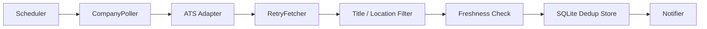
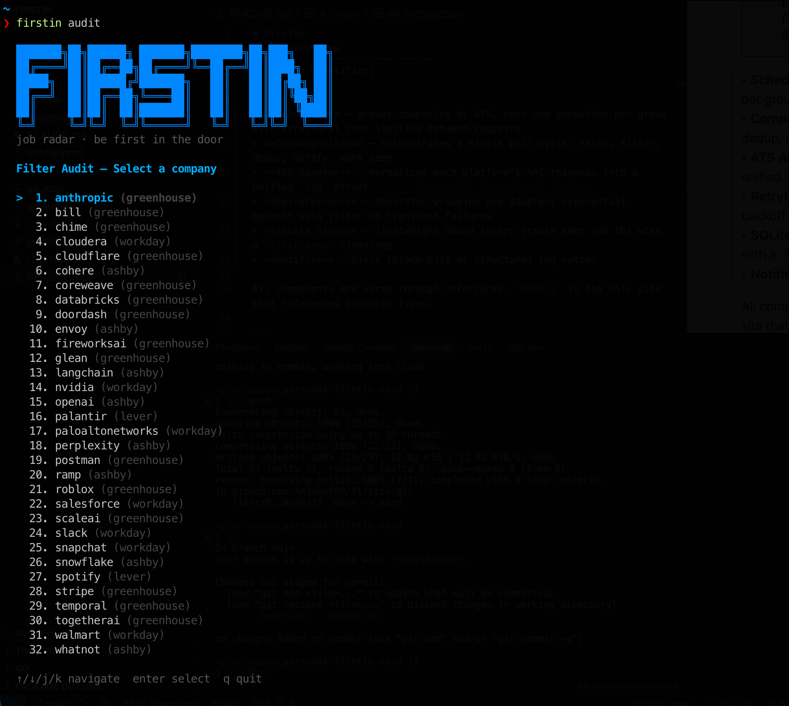

<div align="center">

# FirstIn

Poll company career pages directly. Get notified before the listing spreads.

</div>

---

- [Architecture](#architecture)
- [Features](#features)
- [Getting Started](#getting-started)
  - [1. Prerequisites](#1-prerequisites)
  - [2. Clone and build](#2-clone-and-build)
  - [3. Set environment variables](#3-set-environment-variables)
  - [4. Edit config.yaml](#4-edit-configyaml)
  - [5. Verify your setup](#5-verify-your-setup)
  - [6. Run the daemon](#6-run-the-daemon)
  - [7. Deploy as a systemd service (recommended)](#7-deploy-as-a-systemd-service-recommended)
- [Configuration](#configuration)
- [Usage](#usage)
- [License](#license)

---

FirstIn monitors ATS career APIs on a configurable schedule, filters postings by title and location keywords, deduplicates against a local SQLite store, and sends alerts via Slack or stdout when new matches appear.

It targets source APIs directly - Greenhouse, Ashby, Lever, and Workday, rather than job aggregators. Each polling cycle fetches fresh listings, applies freshness and keyword filters, and only notifies on jobs it has not seen before.

On first run, existing listings are silently seeded into the store. Subsequent runs alert only on genuinely new postings.

---

> ❗ **Note on polling behavior:** FirstIn targets public ATS APIs that companies intentionally expose for career page integrations. It does not scrape HTML, bypass authentication, or simulate browsers. Requests are spaced by a configurable minimum delay (default 10 minutes between requests to any given ATS).

---

## Architecture



▸ **Scheduler** — groups companies by ATS, runs one goroutine per group with structural rate limiting between requests  
▸ **CompanyPoller** — orchestrates a single poll cycle: fetch, filter, dedup, notify, mark seen  
▸ **ATS Adapter** — normalizes each platform's API response into a unified `Job` struct  
▸ **RetryFetcher** — decorator wrapping any adapter; exponential backoff with jitter on transient failures  
▸ **SQLite Store** — lightweight dedup layer; tracks seen job IDs with a `first_seen` timestamp  
▸ **Notifier** — Slack (Block Kit) or structured log output  

All components are wired through interfaces. `main()` is the only site that references concrete types.

---

## Features

| Capability | Description |
|---|---|
| Multi-ATS support | Greenhouse, Ashby, Lever, and Workday adapters included |
| Keyword filtering | Case-insensitive substring matching on title and location, with include and exclude lists |
| Freshness gating | Jobs older than `max_age` (default `24h`) are skipped after the initial seed run |
| Deduplication | SQLite-backed seen-jobs store; each job ID is persisted on first encounter |
| Retry with backoff | Exponential backoff with ±30% jitter; respects `Retry-After` on HTTP 429 |
| Rate limiting | Configurable minimum delay between requests to the same ATS (default 10m) |
| Slack notifications | Block Kit messages with apply button; flood-protected with per-message delay |
| TUI audit browser | Interactive split-pane viewer to browse and inspect live job listings |
| Dry-run mode | One-shot poll with no writes to the store; useful for testing filters |
| Single binary | No runtime dependencies; runs on Linux, macOS, or Docker |

### FirstIn TUI

---

## Getting Started

This section walks through going from zero to a running instance.

### 1. Prerequisites

- Go 1.24 or later
- [`just`](https://github.com/casey/just) — task runner (`brew install just` on macOS)
- A Slack incoming webhook URL if you want Slack notifications (optional; log output works without it)

### 2. Clone and build

```sh
git clone https://github.com/amishk599/firstin.git
cd firstin
just build
```

This produces a `firstin` binary in the project root.

### 3. Set environment variables

| Variable | Required | Description |
|---|---|---|
| `SLACK_WEBHOOK_URL` | Only if using Slack | Incoming webhook URL from your Slack app settings |
| `FIRSTIN_CONFIG` | No | Absolute path to a config file; overrides the default `./config.yaml` |

For a quick local setup:

```sh
export SLACK_WEBHOOK_URL="https://hooks.slack.com/services/..."
```

If you prefer log output over Slack, skip this entirely and set `notification.type: log` in `config.yaml`.

### 4. Edit config.yaml

The repo ships with `config.yaml` pre-populated with 27 companies. At minimum, review:

- `notification.type` — set to `slack` or `log`
- `filters.title_keywords` — roles you want to match
- `filters.locations` — locations you care about
- `companies` — enable/disable entries as needed

See the [Configuration](#configuration) section for the full schema.

### 5. Verify your setup

Run a dry-run first. This polls all enabled companies once, prints matches, and writes nothing to the database:

```sh
just dry-run
# or
./firstin check
```

If you configured Slack, send a test message to confirm the webhook works:

```sh
./firstin notify test
```

### 6. Run the daemon

```sh
just run
# or
./firstin start
```

The daemon polls on the configured interval (default 10m), logs progress to stdout, and sends Slack alerts when new roles are found. 

Running it locally works, but a cheap VPS (any $4–6/month instance) is the better choice. The daemon needs to stay online continuously to catch postings within minutes of them going live. A laptop that sleeps or a terminal session you close will miss the window.

### 7. Deploy as a systemd service (recommended)

Copy the binary and config to the server:

```sh
scp firstin user@your-vps:~/firstin
scp config.yaml user@your-vps:~/config.yaml
```

Create a dedicated user and move files into place:

```sh
sudo useradd --system --no-create-home --shell /usr/sbin/nologin firstin
sudo mkdir -p /opt/firstin
sudo mv ~/firstin /opt/firstin/firstin
sudo mv ~/config.yaml /opt/firstin/config.yaml
sudo chown -R firstin:firstin /opt/firstin
```

Create the service unit at `/etc/systemd/system/firstin.service`:

```ini
[Unit]
Description=FirstIn job polling daemon
After=network-online.target
Wants=network-online.target

[Service]
Type=simple
User=firstin
WorkingDirectory=/opt/firstin
ExecStart=/opt/firstin/firstin start --config /opt/firstin/config.yaml
Restart=on-failure
RestartSec=15s
Environment=SLACK_WEBHOOK_URL=https://hooks.slack.com/services/...

[Install]
WantedBy=multi-user.target
```

Enable and start it:

```sh
sudo systemctl daemon-reload
sudo systemctl enable --now firstin
```

Check that it is running:

```sh
sudo systemctl status firstin
sudo journalctl -u firstin -f
```

The service restarts automatically on failure and comes back up after a reboot. The SQLite database (`jobs.db`) is written to `/opt/firstin/` alongside the binary.

---

## Configuration

Full schema reference for `config.yaml`:

```yaml
polling_interval: 10m          # how often to run a full pass over all companies

rate_limit:
  min_delay: 600s               # minimum gap between requests to the same ATS

notification:
  type: slack                   # "slack" or "log"
  webhook_url: "${SLACK_WEBHOOK_URL}"

filters:
  max_age: 24h                  # ignore postings older than this
  title_keywords:               # include if title contains ANY of these
    - software engineer
    - backend
    - golang
  title_exclude_keywords:       # exclude if title contains ANY of these
    - manager
    - intern
  locations:                    # include if location contains ANY of these
    - United States
    - Remote
  exclude_locations:            # exclude if location contains ANY of these
    - Canada

companies:
  - name: stripe
    ats: greenhouse
    board_token: "stripe"       # token from the Greenhouse board URL
    enabled: true

  - name: openai
    ats: ashby
    board_token: "openai"
    enabled: true

  - name: spotify
    ats: lever
    board_token: "spotify"
    enabled: true

  - name: nvidia
    ats: workday
    workday_url: "https://nvidia.wd5.myworkdayjobs.com/NVIDIAExternalCareerSite"
    enabled: true
```

`${VAR}` expressions anywhere in the file are expanded from environment variables at load time.

To find a company's board token: open their careers page in a browser, open the network tab, and look for the ATS API request. The token appears in the request path.

---

## Usage

```sh
firstin start          # run the polling daemon (default)
firstin check          # one-shot poll, dry-run (no writes to store)
firstin audit          # interactive TUI to browse live listings (run locally)
firstin companies      # list all configured companies
firstin notify test    # send a test Slack message
firstin version        # print version
```

`firstin audit` is meant to be run locally. It opens an interactive terminal UI that requires a proper TTY — it will not work over a headless SSH session or inside a systemd service. Use it on your laptop to browse and inspect listings on demand, pointed at the same `config.yaml` the VPS uses.

All other commands accept `--config` to specify an alternate config path and `--debug` for verbose output.

```sh
firstin start --config /etc/firstin/config.yaml --debug
```

The `FIRSTIN_CONFIG` environment variable is also respected when `--config` is not set.

---

## License

MIT — see [LICENSE](LICENSE)
